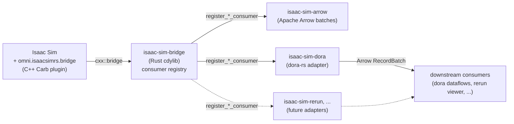

# isaac-sim-rs

[](https://www.mozilla.org/MPL/2.0/)
[](https://developer.nvidia.com/isaac/sim)
[](https://github.com/dora-rs/dora)
[](https://www.rust-lang.org/)

Unofficial Rust SDK for [NVIDIA Isaac Sim](https://developer.nvidia.com/isaac/sim) & [Omniverse](https://developer.nvidia.com/omniverse). Bridges Isaac Sim's C++ Carbonite plugin surface and OmniGraph runtime into safe Rust callbacks, with **transport-agnostic** consumer adapters — your data goes to [`dora-rs`](https://github.com/dora-rs/dora), [`rerun`](https://rerun.io), a file logger, or any custom bus you wire up, **without** a Python or ROS hop in the hot path.

Maintained by [Astro Robotics](https://github.com/AstroRoboticsTech). MPL-2.0.

## Why

Isaac Sim ships a Python API and a ROS 2 bridge. Both add a serialization hop on every sensor frame and constrain the runtime your robotics stack can use. `isaac-sim-rs` skips both: a custom Carb C++ extension `dlopen`s a Rust `cdylib`, sensor buffers cross via [`cxx::bridge`](https://cxx.rs), and downstream consumers register Rust callbacks. Native C++ ↔ Rust handoff, no language jump, no IPC marshalling tax.

## Architecture



The core (`isaac-sim-bridge`) has zero adapter dependencies. Adapters (`isaac-sim-dora`, future `isaac-sim-rerun`, etc.) depend on the core, never the other way around.

## What works today

- `omni.isaacsimrs.bridge` Carb extension loads in Isaac Sim 5.1 with full OmniGraph + USD + GSL toolchain (CMake build, packman-fetched USD).
- Custom OmniGraph nodes authored in C++ via the standard `.ogn` codegen, registered eagerly so they're visible in OG graphs the moment the extension loads.
- `OgnPublishLidarToRust` accepts a 2D RTX LiDAR flat scan (matches the output schema of NVIDIA's `IsaacComputeRTXLidarFlatScan`) and forwards depths + intensities + metadata to Rust via `cxx::bridge`.
- `isaac-sim-bridge` exposes a thread-safe consumer registry: any Rust closure that takes `(&[f32], &[u8], &ScanMeta)` can be registered and gets dispatched on every scan.
- `isaac-sim-arrow` converts `LidarScan` to an Apache Arrow `RecordBatch` (single row per scan: `List<Float32>` for depths, `List<UInt8>` for intensities, scalars for the metadata).
- `isaac-sim-dora` is both an `rlib` (downstream Rust crates use the helper API) and a `cdylib` that the bridge dlopens at startup when `ISAAC_SIM_RS_DORA_RUNNER` env var is set — turns Kit into a dora source node with no extra extension code.
- `examples/lidar-receiver/` ships a runnable end-to-end pipeline (Kit-as-dora-source + Mac/Linux receiver), verified producing 10 Hz Arrow batches under a real dora coordinator.

## Quick start

```bash
# 1. clone
git clone https://github.com/AstroRoboticsTech/isaac-sim-rs.git
cd isaac-sim-rs

# 2. point at your Isaac Sim install
export ISAAC_SIM=/path/to/isaac-sim
export ISAAC_SIM_RS=$(pwd)

# 3. build (cmake drives cargo for every workspace cdylib via a
#    custom target; CMake fetches USD via NVIDIA packman the first
#    time, ~3.8 GB)
ISAAC_SIM_PATH=$ISAAC_SIM CARGO_PROFILE=release just build

# 4. run the example dora pipeline
cd $ISAAC_SIM_RS/examples/lidar-receiver
dora up
dora build dataflow.yml
dora start dataflow.yml --detach

# 5. watch the receiver
RUN=$(dora list | awk '/Running/ {print $1}')
dora logs $RUN receiver
# [receiver] scan: n=360 fov=360.0° rate=10.0Hz depth=[3.000,7.000]m
# (repeating at 10 Hz)
```

See [`examples/lidar-receiver/README.md`](examples/lidar-receiver/README.md) for the full walkthrough.

The full set of public recipes is `just --list` (workspace tests, clippy, fmt, link-smoke, kit-smoke, clean). Per-developer cross-host helpers go in `justfile.local` (gitignored).

## Crates

| Crate                                          | Purpose                                                                                     |
| ---------------------------------------------- | ------------------------------------------------------------------------------------------- |
| [`carb-sys`](crates/carb-sys/)                 | Raw FFI bindings to the NVIDIA Carbonite SDK (bindgen, env-driven build)                    |
| [`isaac-sim-bridge`](crates/isaac-sim-bridge/) | C++ ↔ Rust bridge cdylib + consumer registry. The hub everything else plugs into.           |
| [`isaac-sim-arrow`](crates/isaac-sim-arrow/)   | Apache Arrow conversion utilities for sensor data. Consumer-agnostic.                       |
| [`isaac-sim-dora`](crates/isaac-sim-dora/)     | dora-rs publisher adapter; rlib for in-process registration + cdylib for the bridge to load |

## Examples

| Example                                      | Demonstrates                                                      |
| -------------------------------------------- | ----------------------------------------------------------------- |
| [`lidar-receiver`](examples/lidar-receiver/) | Kit-as-dora-source + receiver dora node; full end-to-end pipeline |

More planned (cross-host rerun viewer, camera, IMU). Each will live in its own self-contained `examples/<name>/` directory.

## Compatibility

|              | Tested on                                             |
| ------------ | ----------------------------------------------------- |
| Isaac Sim    | 5.1.0-rc.19 (Linux x86_64)                            |
| GPU / CUDA   | NVIDIA RTX 4090, CUDA 12.6, driver 550.x              |
| OS           | Ubuntu 24.04 (other modern Linux distros should work) |
| Compiler     | gcc 13.3, CMake 3.28                                  |
| Rust         | rustc 1.85+ (workspace `rust-version = "1.85"`)       |
| dora-rs      | 0.5 (dora-cli, dora-node-api 0.5)                     |
| Apache Arrow | 54 (workspace-pinned to match dora)                   |

The C++ plugin is Linux-only (Isaac Sim runs only on Linux/Windows). The Rust crates compile on macOS for development — `cargo check`, `cargo test` for the pure-Rust crates work locally; the bridge cdylib needs the Carb headers from a real Isaac Sim install.

## License

[Mozilla Public License 2.0](LICENSE). File-level copyleft: use this SDK in any project (commercial, proprietary, open-source). Modifications to source files in this repository must be released under MPL-2.0. See [LICENSE](LICENSE) for full terms.

## Prior art

This SDK builds on patterns first explored by:

- [`AndrejOrsula/omniverse_rs`](https://github.com/AndrejOrsula/omniverse_rs) — autocxx-based Omniverse interface (dormant since 2024)
- [`AndrejOrsula/isaac_sim_rs`](https://github.com/AndrejOrsula/isaac_sim_rs) — Rust interface for Isaac Sim (dormant since 2024)
- [`AndrejOrsula/pxr_rs`](https://github.com/AndrejOrsula/pxr_rs) — autocxx-based OpenUSD bindings

We may vendor `pxr_rs` for USD support rather than reimplement.

## Related

- [NVIDIA Isaac Sim](https://github.com/isaac-sim/IsaacSim) — open-source RTX sensor sources we wire into via sibling OmniGraph nodes
- [dora-rs](https://github.com/dora-rs/dora) — low-latency dataflow runtime; first-class consumer
- [rerun](https://github.com/rerun-io/rerun) — interactive 3D viewer; planned consumer adapter
- [Apache Arrow](https://arrow.apache.org) — universal columnar interchange format used by all our consumer adapters

## Contributing

Pull requests welcome. The repo is in early development and APIs may change. CONTRIBUTING.md and a CLA setup are coming.
