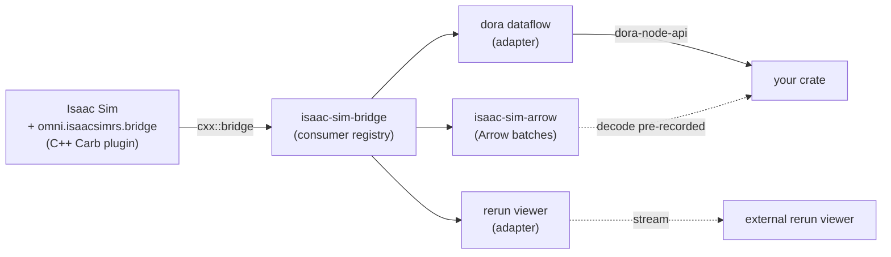

# Integrating isaac-sim-rs

Reference for downstream Rust crates depending on `isaac-sim-rs`. Pairs with [`USER_GUIDE.md`](USER_GUIDE.md) (Isaac Sim user track, Kit extension install) and the rustdoc on [docs.rs/isaac-sim-rs](https://docs.rs/isaac-sim-rs).

## Where the surface lives

The facade crate is a thin re-export layer; pick one of its feature flags depending on how deep into the runtime you go.

## Pick a feature flag

| Feature  | What you get | Isaac Sim install required? | Typical use |
|----------|--------------|:---------------------------:|-------------|
| default (`arrow`) | Pure-Rust Arrow schema + decoders for every bridged sensor | No | Decode previously captured batches; unit-test perception code without simulation |
| `bridge`         | Adds the cxx::bridge core: consumer / producer registries, source filters | No (compiles as rlib) | You build your own adapter and want the registry primitives |
| `dora`           | Adds the dora-rs publisher + subscriber adapters | No (decoder side); Yes for the cdylib loaded by Kit | Subscribe to a running Isaac Sim's sensor stream from a dora node |
| `rerun`          | Adds the rerun viewer adapter (per-sensor RecordingStream, gRPC client) | Yes for the cdylib; No for a downstream rerun viewer host | Stream sensors to a rerun viewer (local or remote) |
| `full`           | dora + rerun together | Yes for the Kit-side cdylib | A full bridge + dora + rerun pipeline (the nova-carter example shape) |

Default features keep the dependency tree pure-Rust. Adapter features pull the bridge rlib chain transitively.

## Three integration shapes

### A. Decoder-only

Your crate has no live Isaac Sim. It receives Arrow record batches over the wire (file replay, network bus, message broker) and decodes them into native Rust structs. Default features are enough. Useful for offline analysis, regression tests, and CI.

### B. Dora subscriber

A running Isaac Sim publishes through the Kit extension; your crate is a downstream dora node. Enable the `dora` feature. Wire your dora input to the bridge node's matching output, decode the inbound Arrow array via the convenience subscriber decoders, then run perception / planning / control.

For closed-loop actuation the same crate can publish `cmd_vel` upstream — the bridge subscribes, populates the producer slot, and the C++ apply node consumes it on the next tick.

### C. Full bridge + viewer

Bring in `full` when the same process needs both dora dataflow participation and rerun streaming. The Kit-side adapter list (set in the extension's settings block) decides which adapter cdylibs are dlopened at runtime; downstream Rust crates only declare the feature.

## Compatibility constraints

- **Rust toolchain:** rustc ≥ 1.85 (workspace `rust-version`). Edition is unconstrained — consumers on edition 2024 work fine.
- **Apache Arrow:** workspace pins major version 54, matched to dora-rs 0.5. Mixing a different Arrow major in your dependency tree means feature unification will pick the higher version, which may or may not be compatible with the dora node API your runtime ships against. Pin Arrow to 54 in your own Cargo.toml if cargo's resolver picks an incompatible upgrade.
- **dora-rs:** publishers and subscribers in this SDK target dora 0.5. A different dora version on the same dataflow will need `dora-cli` upgrades on every node host.
- **Isaac Sim:** Kit extension currently ships only Linux x86_64. Mac / Windows hosts can compile the rlib-only path (default + `arrow` + decoder helpers under `dora`) for code that subscribes to a remote Isaac Sim, but the bridge cdylib does not load there.
- **MPL-2.0 file-level copyleft:** any modifications to `isaac-sim-rs` source files must remain MPL-2.0. Code in your own crate that merely depends on this SDK is unaffected.

## Where the assets ship

| Artifact | Channel | Versioning |
|----------|---------|------------|
| Five workspace crates | crates.io | Shared workspace version (e.g. 0.1.0) |
| Kit extension prebuilt tarball + sha256 | GitHub Releases page | Tag-aligned (e.g. `v0.1.0`) |
| API reference | docs.rs | Per-version, automatic on publish |
| Source examples (nova-carter, lidar-receiver, nova-carter-dora) | source repo only | Track `main`; vendor or fork if you depend on shapes |

Releases with code crates and the matching extension tarball ship together — pin both at the same version when a Kit extension upgrade lands.

## When to vendor the example dataflows

The `examples/` directory is reference material: dataflow YAMLs, drive scripts, USD scenes, OG graphs. The crates do not export them. Two patterns:

1. **Reference unchanged.** Clone the source repo, point your robot project at its example launcher, run as-is. Fastest path to "is the bridge alive on my box". Drifts if the upstream example changes shape.
2. **Vendor + own.** Copy the relevant example directory into your project, adjust scene + dataflow + nodes for your robot, treat it as your own code path. Recommended once you outgrow the smoke test.

Either way, your dependency on the SDK stays at `cargo add isaac-sim-rs -F <feature>` — no source coupling.

## Pitfalls

- **Mixed Arrow versions** silently produce a runtime panic on first decode. Cargo's resolver will pull both 54 and 57 if a transitive dep requests the latter. Audit `cargo tree -i arrow` before shipping.
- **Source identifier drift.** Each OG publisher node has a stable per-prim identifier; downstream subscribers filter by this. If two scenes use the same identifier for different sensors the data crosses streams without error. Keep identifiers globally unique per dataflow.
- **Adapter cdylib path resolution.** Kit extension settings list adapter names; the bridge dlopens them from the extension's bin directory at startup. A custom install path means the settings block's adapter-path key needs to override the default location.
- **`cmd_vel` poll-miss is silent.** No producer registered yet means the apply node emits zero — the robot stops, which is the safe default but not always the intended one. Watch the producer registry's slot count if your control loop expects continuous commands.

## Pointers

- Rust API reference: <https://docs.rs/isaac-sim-rs>
- Releases (crates + Kit extension tarball): <https://github.com/AstroRoboticsTech/isaac-sim-rs/releases>
- Kit extension install + OG authoring: [`USER_GUIDE.md`](USER_GUIDE.md)
- Environment variable reference: [`ENV_VARS.md`](ENV_VARS.md)
- Third-party license inventory: [`THIRD_PARTY_LICENSES.md`](THIRD_PARTY_LICENSES.md)
