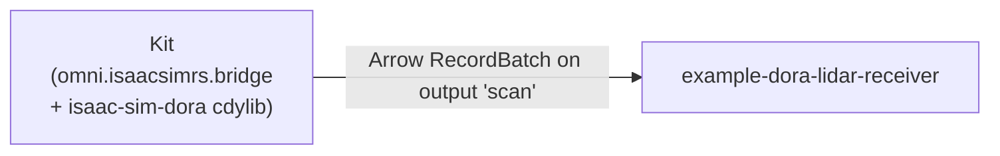

# lidar-receiver — receive a LiDAR stream from Isaac Sim over dora

End-to-end runnable: Isaac Sim is the dora source, the binary in this
directory is the dora receiver that prints a one-line summary per scan.



The bridge's C++ Carb plugin loads `libisaac_sim_bridge.so` (always)
and, when `ISAAC_SIM_RS_DORA_RUNNER` is set, also dlopens
`libisaac_sim_dora.so` and calls its `isaac_sim_dora_init`. That
function calls `DoraNode::init_from_env()` (env vars set by the dora
coordinator) and registers a LiDAR consumer that emits each scan as
an Arrow `StructArray` on the named output.

The Python driver script in this directory (`drive.py`) constructs an
OmniGraph that contains the `PublishLidarToRust` node and ticks fake
inputs every 100 ms. When the upstream RTX setup lands (real
`IsaacComputeRTXLidarFlatScan` driving the same node), the driver
script is replaced by a USD scene + scene-load `--exec`.

## Files

|                             |                                                                                                |
| --------------------------- | ---------------------------------------------------------------------------------------------- |
| `Cargo.toml`, `src/main.rs` | Receiver binary; downcasts the `StructArray` and prints `n=… fov=… rate=… depth=[…]m` per scan |
| `dataflow.yml`              | dora dataflow: `isaac-sim` (Kit) node → `receiver` node, output named `scan`                   |
| `drive.py`                  | Kit `--exec` script that synthesizes scans and ticks the OG node                               |

## Run

Set two env vars (the dataflow YAML reads them):

```bash
export ISAAC_SIM=/path/to/isaac-sim
export ISAAC_SIM_RS=/path/to/this/repo
```

Build the Rust cdylibs + the C++ bridge plugin:

```bash
cd $ISAAC_SIM_RS
ISAAC_SIM_PATH=$ISAAC_SIM CARGO_PROFILE=release just build
```

Launch dora:

```bash
cd $ISAAC_SIM_RS/examples/lidar-receiver
dora up
dora build dataflow.yml
dora start dataflow.yml --attach
```

Expected receiver output (every ~100 ms once Kit finishes startup):

```
[receiver] isaac-sim/scan: n=360 fov=360.0° rate=10.0Hz depth=[3.001,7.000]m
```

`Ctrl-C` to stop. `dora stop && dora destroy` cleans up.
