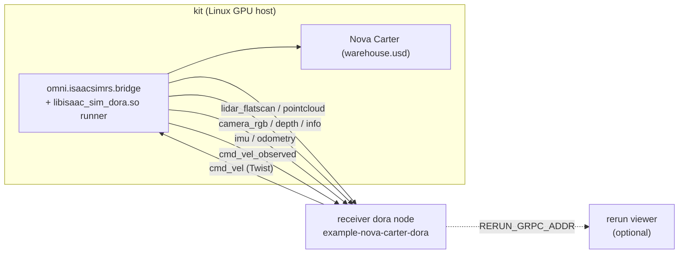

# nova-carter-dora — end-to-end dora validation pipeline

Drives Nova Carter through a warehouse using a multi-process dora
dataflow. Kit (with `omni.isaacsimrs.bridge` + `isaac-sim-dora` as the
runner cdylib) is one dora node, exposing every bridged channel as a
dora output and consuming a `Twist` input. A receiver node decodes
each output with the `isaac_sim_dora::subscribe::*` shims and emits
`Twist` back so the bridge's cmd_vel subscriber drives the
articulation.



## What this validates

Single launch exercises every code path the recent symmetry pass
introduced:

| Path                                              | Evidence                                                        |
| ------------------------------------------------- | --------------------------------------------------------------- |
| 7 dora sensor publishers (bridge → dora output)   | receiver prints one summary per channel within seconds          |
| 7 dora subscribe decoders (`subscribe::*`)        | summaries non-empty + dimensions match the Kit-side schema      |
| dora cmd_vel subscriber (Arrow → bridge slot)     | Carter visibly drives; odometry shows non-zero pos + velocities |
| dora cmd_vel publisher (bridge observer → output) | `cmd_vel_observed` line shows the same Twist receiver emitted   |
| Bridge `ProducerRegistry` observer fan-out        | each receiver-emitted Twist appears on `cmd_vel_observed` once  |
| Rerun-via-dora viz (subscription-only pipeline)   | with `RERUN_GRPC_ADDR` set, scalars + pointcloud appear in viewer; rerun never touches the bridge directly |

The same C++ apply node + Rust producer registry that the rerun
example exercises is reused — the only thing that changes is the
runner cdylib (`libisaac_sim_dora.so` instead of
`libexample_nova_carter.so`) and the source of the Twist (a dora
upstream input instead of a Rust-side demo thread).

## Files

|                  |                                                                                                            |
| ---------------- | ---------------------------------------------------------------------------------------------------------- |
| `Cargo.toml`     | receiver binary; depends on `isaac-sim-dora` (rlib for subscribe shims) + `isaac-sim-arrow` + `rerun`      |
| `dataflow.yml`   | two nodes: `kit` (8 outputs, 1 input) and `receiver` (8 inputs, 1 output)                                  |
| `launch-kit.sh`  | sets `ISAAC_SIM_RS_DORA_RUNNER` + per-sensor `_SOURCE`/`_OUTPUT` + cmd_vel pub/sub env vars and execs Kit  |
| `src/main.rs`    | receiver event loop: decode → summarise → re-emit Twist on every odometry tick                            |
| (uses)           | `examples/nova-carter/drive.py` — same scene as the rerun example, no duplication                          |

## Prerequisites

- Linux GPU host with Isaac Sim 5.1+ (`ISAAC_SIM` exported).
- `dora-cli` 0.5 on PATH (`cargo install dora-cli@0.5` or distro
  package).
- Optional viewer host with `rerun` 0.31 on PATH.

## Build

```bash
export ISAAC_SIM=/path/to/isaac-sim
export ISAAC_SIM_RS=/path/to/this/repo
cd $ISAAC_SIM_RS
ISAAC_SIM_PATH=$ISAAC_SIM CARGO_PROFILE=release just build
```

## Run

```bash
cd $ISAAC_SIM_RS/examples/nova-carter-dora
dora up
dora build dataflow.yml
dora start dataflow.yml --detach
RUN=$(dora list | awk '/Running/ {print $1}')
dora logs $RUN receiver
```

Within a few seconds the receiver log emits one line per channel,
followed by Carter's chassis position progressing as the cmd_vel
output drives the articulation.

To enable the rerun-via-dora viz pipeline:

```bash
# viewer host
rerun --port 9876 --bind 0.0.0.0

# linux host, before `dora start`
export RERUN_GRPC_ADDR=<viewer-host-ip>:9876
dora start dataflow.yml --detach
```

The rerun viewer only ever sees data flowing through dora outputs.
The bridge's own consumer registry isn't subscribed to; this is the
"subscription-only viz" path — useful when the algorithm node is the
canonical place sensor data lands and rerun is downstream.

## Stop

```bash
dora stop $RUN
dora destroy
```
