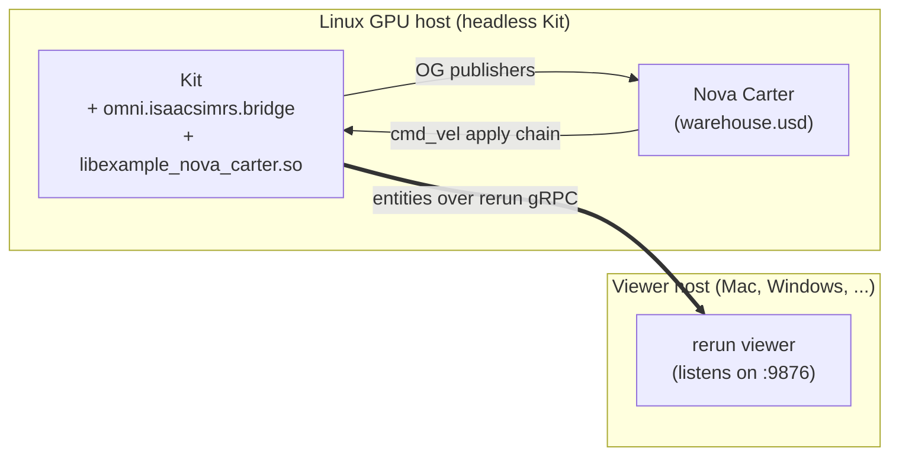

# nova-carter — Nova Carter end-to-end demo

Drops a Nova Carter robot into a warehouse, attaches every sensor the
SDK supports today (2D + 3D LiDAR, RGB + depth camera + camera info,
IMU, chassis odometry), wires the cmd_vel apply chain so a Rust thread
can drive the articulation, and streams everything to a `rerun` viewer
over rerun's native gRPC.



`src/lib.rs` is a `cdylib` the bridge plugin `dlopen`s when
`ISAAC_SIM_RS_RERUN_RUNNER` points at it. It

1. registers the `cmd_vel` producer slot for Carter and spawns a
   thread that publishes a constant-arc Twist (`linear_x = 0.4 m/s`,
   `angular_z = 0.3 rad/s` @ 50 Hz);
2. builds an `isaac_sim_rerun::Viewer` with one consumer per sensor —
   all sensor entities are reparented under `chassis`, so the
   odometry-driven `Transform3D` on `chassis` moves every sensor
   frustum / scan with the robot.

## Files

|                |                                                                                                          |
| -------------- | -------------------------------------------------------------------------------------------------------- |
| `Cargo.toml`   | `cdylib` crate; depends on `isaac-sim-bridge` + `isaac-sim-rerun`                                        |
| `src/lib.rs`   | Viewer wiring (one `with_source` per sensor) + cmd_vel demo thread                                       |
| `launch.sh`    | Sets `ISAAC_SIM_RS_RERUN_RUNNER` + `ISAAC_SIM_RS_RERUN_GRPC_ADDR` and execs Kit headless (`--no-window`) |
| `drive.py`     | Kit `--exec` script: opens warehouse, references Carter, attaches sensors + publisher graph + cmd_vel    |

## Sensor topology

| Sensor               | Carter prim                                        | Publisher node                       | Cadence       |
| -------------------- | -------------------------------------------------- | ------------------------------------ | ------------- |
| 2D LiDAR (FlatScan)  | `chassis_link/lidar_2d`                            | `PublishLidarFlatScanToRust`         | 10 Hz         |
| 3D LiDAR (PointCloud)| `chassis_link/sensors/XT_32/PandarXT_32_10hz`      | `PublishLidarPointCloudToRust`       | 10 Hz         |
| Camera RGB           | `chassis_link/camera_rgb`                          | `PublishCameraRgbToRust`             | render rate   |
| Camera depth         | `chassis_link/camera_rgb` (same prim)              | `PublishCameraDepthToRust`           | render rate   |
| Camera info          | `chassis_link/camera_rgb`                          | `PublishCameraInfoToRust`            | render rate   |
| IMU                  | `chassis_link/imu`                                 | `PublishImuToRust`                   | FlatScan exec |
| Chassis odometry     | `chassis_link` (articulation root)                 | `PublishOdometryToRust`              | FlatScan exec |
| cmd_vel apply        | target = `/Root/World/Carter`                      | `ApplyCmdVelFromRust` → DiffCtrl → ArtCtrl | FlatScan exec |

Carter's articulation root is `chassis_link`, not the top-level
`/Root/World/Carter`. `IsaacComputeOdometry` rejects the latter.

Drive joints are `joint_wheel_left` + `joint_wheel_right`. Wheel
geometry: `radius = 0.14 m`, `track = 0.413 m`. These feed the
`DifferentialController` twist→wheel-velocity conversion.

## Prerequisites

- Linux GPU host with Isaac Sim 5.1+ (`ISAAC_SIM` exported).
- Viewer host with the `rerun` binary on PATH at the same major.minor
  version as the SDK pinned here (currently `0.31`):
  `cargo binstall rerun-cli@0.31` or `pip install rerun-sdk==0.31`.
- L3 reachability between the two; rerun's gRPC port (9876) reachable
  from the Linux host.

## Build

```bash
export ISAAC_SIM=/path/to/isaac-sim
export ISAAC_SIM_RS=/path/to/this/repo
cd $ISAAC_SIM_RS
ISAAC_SIM_PATH=$ISAAC_SIM CARGO_PROFILE=release just build
```

`just build` drives both cargo and cmake; `libexample_nova_carter.so`
lands next to the plugin in `cpp/omni.isaacsimrs.bridge/bin/`, which
is where `launch.sh` looks for it.

## Run

**Viewer host**, in one terminal:

```bash
rerun --port 9876 --bind 0.0.0.0
```

`--bind 0.0.0.0` lets the Linux host connect; default binds to
localhost only.

**Linux host**, in another terminal:

```bash
export ISAAC_SIM=/path/to/isaac-sim
export ISAAC_SIM_RS=/path/to/this/repo
export ISAAC_SIM_RS_RERUN_GRPC_ADDR=<viewer-host-ip>:9876
$ISAAC_SIM_RS/examples/nova-carter/launch.sh
```

Within a few seconds of Kit finishing startup the viewer shows
Carter arcing through the warehouse with all sensor frustums + scans
attached. `Ctrl-C` on the Kit terminal to stop.

For a single-host smoke test, omit `ISAAC_SIM_RS_RERUN_GRPC_ADDR` (it
defaults to `127.0.0.1:9876`) and drop `--bind 0.0.0.0` from the
viewer.

## Configuration

The gRPC address resolves in this order:

1. `Viewer::with_grpc_addr(...)` in `src/lib.rs` (programmatic override)
2. `ISAAC_SIM_RS_RERUN_GRPC_ADDR` env var
3. `127.0.0.1:9876`

## Customizing

`src/lib.rs` is the user-facing demo. Edit the body of `try_init` to:

- swap a sensor's entity path: `.with_source(LidarPointCloud, prim, "your/path")`
- add a programmatic gRPC override: `.with_grpc_addr("...")`
- replace the constant cmd_vel thread with a joystick / RL policy /
  dora subscriber that calls `register_cmd_vel_producer(target).publish(...)`.

Rebuild with `just build` — cmake refreshes both the cdylib and the
`bin/` copy.
