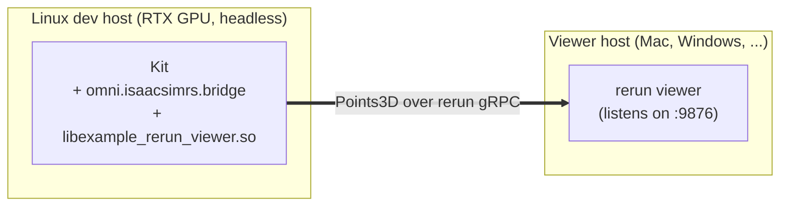

# rerun-viewer — cross-host rerun viewer for an Isaac Sim LiDAR stream

Linux GPU host runs Kit and pushes each LiDAR scan to a `rerun` viewer
on a separate machine over rerun's own gRPC. No dora coordinator, no
per-machine daemons.



The example is a small `cdylib` crate (`src/lib.rs`) that uses the
`isaac_sim_rerun::Viewer` builder to subscribe a LiDAR consumer and
log a one-shot blueprint hint. The bridge plugin's `EagerInit` ctor
`dlopen`s the resulting `.so` when `ISAAC_SIM_RS_RERUN_RUNNER` points
at it, calls `isaac_sim_rerun_init`, and the builder's `.run()` opens
the `RecordingStream` and registers the consumer.

## Files

|                         |                                                                                       |
| ----------------------- | ------------------------------------------------------------------------------------- |
| `Cargo.toml`            | `cdylib` crate; depends on `isaac-sim-rerun`                                          |
| `src/lib.rs`            | The example body — edit to change entity paths, add a blueprint, etc.                 |
| `launch-kit-rerun.sh`   | Sets `ISAAC_SIM_RS_RERUN_RUNNER` to this example's `.so` and execs Kit                |
| `drive.py`              | Kit `--exec` script that synthesizes scans and ticks the OG node (same as Phase 1)    |

## Prerequisites

- Linux GPU host with Isaac Sim 5.1+ installed.
- Viewer host with the `rerun` binary on PATH at the same major.minor
  version as the SDK pinned in this workspace (currently `0.31`):
  `cargo binstall rerun-cli@0.31` or `pip install rerun-sdk==0.31`.
- L3 reachability between the two; rerun's gRPC port (9876) open from
  Linux to the viewer host.

## Build (Linux only)

```bash
export ISAAC_SIM=/path/to/isaac-sim
export ISAAC_SIM_RS=/path/to/this/repo
cd $ISAAC_SIM_RS
ISAAC_SIM_PATH=$ISAAC_SIM CARGO_PROFILE=release just build
```

`just build` drives both cargo and cmake; `libexample_rerun_viewer.so`
lands next to the plugin in `cpp/omni.isaacsimrs.bridge/bin/`, which is
where `launch-kit-rerun.sh` looks for it.

## Run

**Viewer host**, in one terminal:

```bash
rerun --port 9876 --bind 0.0.0.0
```

`--bind 0.0.0.0` is needed so the Linux host can reach it; the default
binds to localhost only.

**Linux host**, in another terminal:

```bash
export ISAAC_SIM=/path/to/isaac-sim
export ISAAC_SIM_RS=/path/to/this/repo
export ISAAC_SIM_RS_RERUN_GRPC_ADDR=<viewer-host-ip>:9876
$ISAAC_SIM_RS/examples/rerun-viewer/launch-kit-rerun.sh
```

Within a few seconds of Kit finishing startup the viewer shows the
synthesized 360-beam scan as a point cloud at `scene/lidar/scan`,
updating at 10 Hz. `Ctrl-C` on the Kit terminal to stop.

For a single-host smoke test, omit `ISAAC_SIM_RS_RERUN_GRPC_ADDR` (it
defaults to `127.0.0.1:9876`) and drop `--bind 0.0.0.0` from the viewer.

## Configuration

The gRPC address resolves in this order:

1. `Viewer::with_grpc_addr(...)` in `src/lib.rs` (programmatic override)
2. `ISAAC_SIM_RS_RERUN_GRPC_ADDR` env var
3. `127.0.0.1:9876`

The env-var path means the address can also be set inside a dora
dataflow YAML when Kit is launched as a dora node, by adding it to
the relevant node's `env:` block — no Rust change required.

## Customizing the example

`src/lib.rs` is the user-facing demo. Edit the body of `try_init` to:

- change the LiDAR entity path: `.with_lidar(source, "your/path")`
- add a programmatic gRPC override: `.with_grpc_addr("...")`
- replace the blueprint closure with your own startup logic, e.g.
  logging a `rerun::blueprint::*` view definition.

Rebuild with `just build` — cmake will refresh both the cdylib and
the bin/ copy automatically.
